<br/>
<p align="center">
  <a href="https://github.com/omd01/School-Management-System">
    
  </a>

  <h3 align="center">School Management System</h3>

  <p align="center">
    The School Management System is a web application built using PHP, designed to streamline and automate various administrative tasks within a school environment. It serves as a centralized platform for managing student records, faculty information, and other essential aspects of school administration.
    <br/>
    <br/>
    <a href="https://github.com/omd01/School-Management-System"><strong>Explore the docs »</strong></a>
    <br/>
    <br/>
    <a href="https://github.com/omd01/School-Management-System">View Demo</a>
    .
    <a href="https://github.com/omd01/School-Management-System/issues">Report Bug</a>
    .
    <a href="https://github.com/omd01/School-Management-System/issues">Request Feature</a>
  </p>
</p>

    

## Table Of Contents

* [About the Project](#about-the-project)
* [Built With](#built-with)
* [Getting Started](#getting-started)
  * [Prerequisites](#prerequisites)
  * [Installation](#installation)
* [Usage](#usage)
* [Roadmap](#roadmap)
* [Contributing](#contributing)
* [License](#license)
* [Authors](#authors)
* [Acknowledgements](#acknowledgements)

## About The Project

* Home Screen

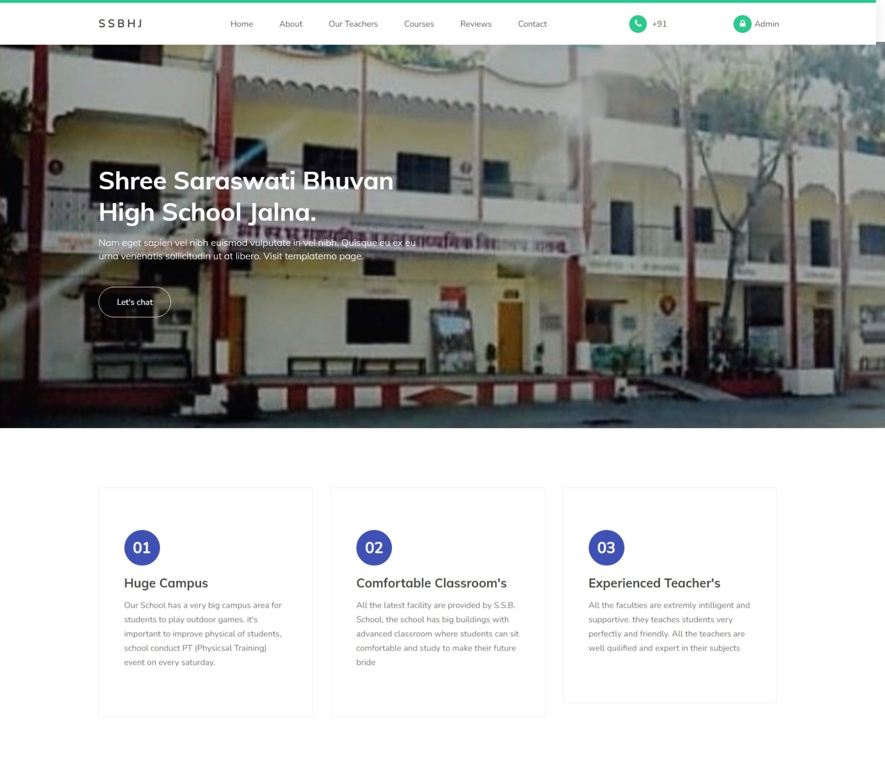

* About Screen

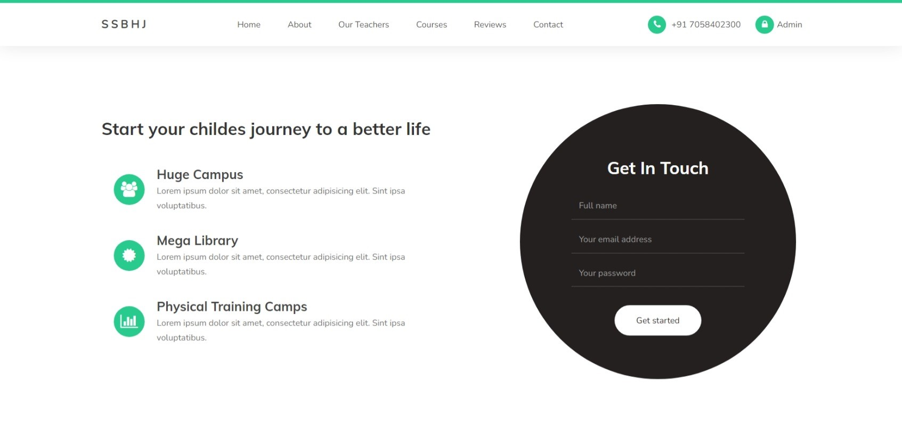

* Teachers Screen

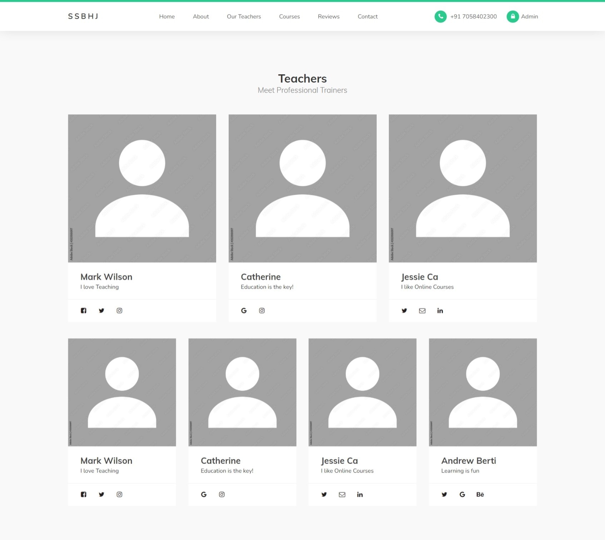

* Courses Screen

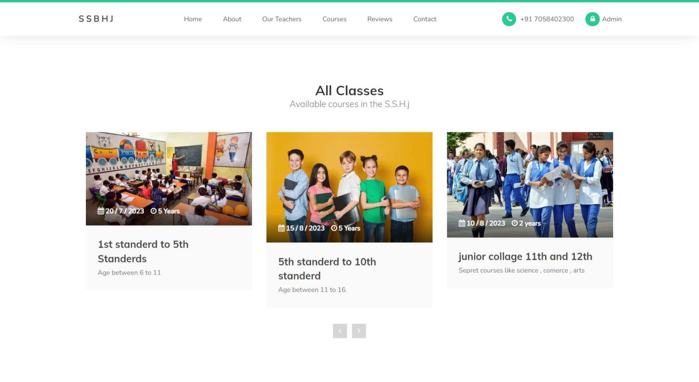

* Reviews Screen

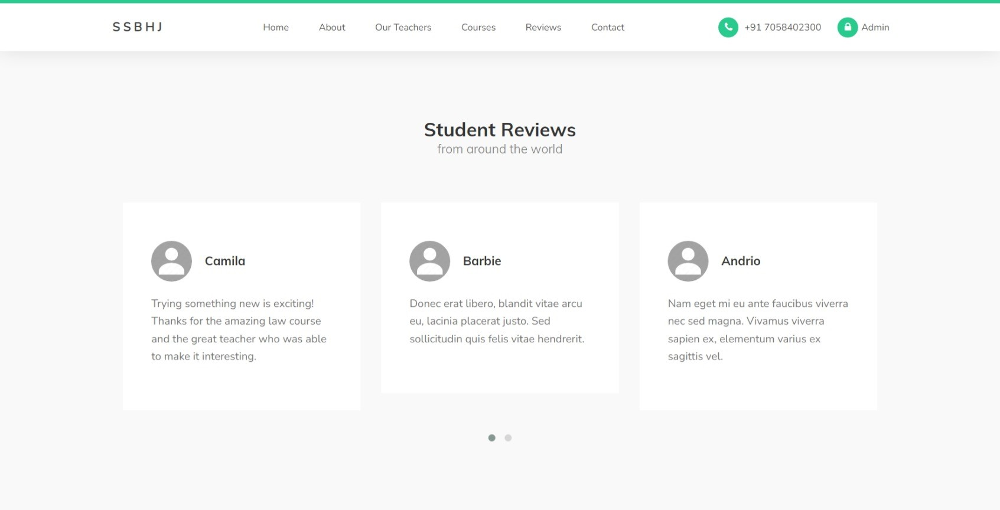

* Contact Screen

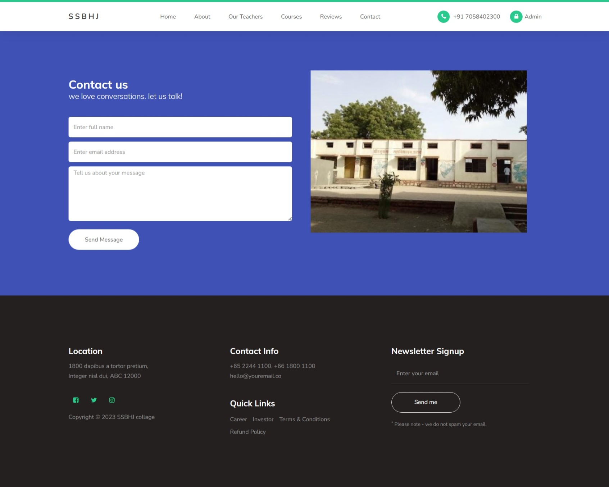


* Admin Login Screen

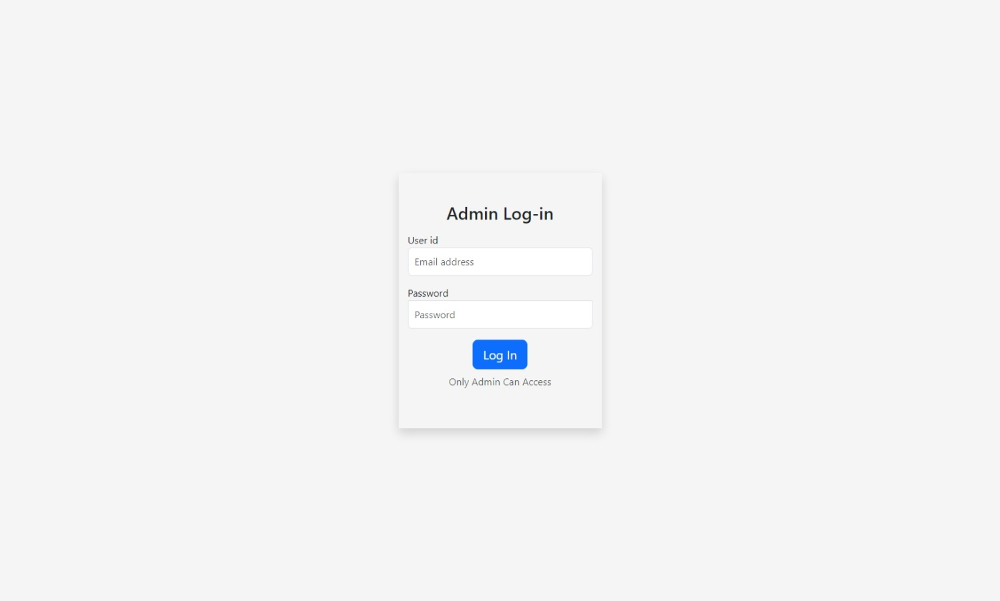

* Admin Dashboard Screen

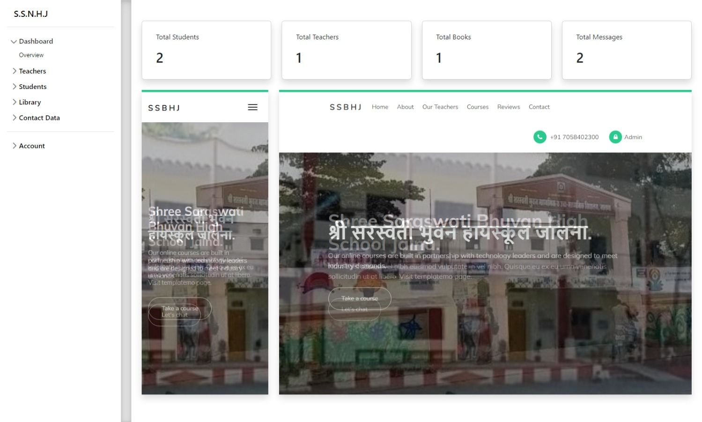

* Admin Add New Student Screen

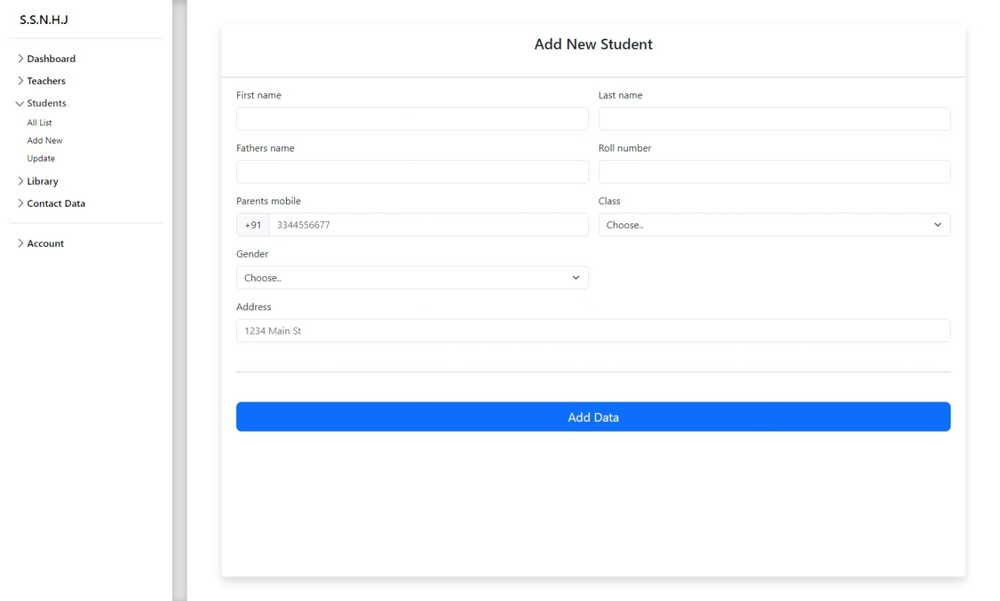

* Admin List Students Screen

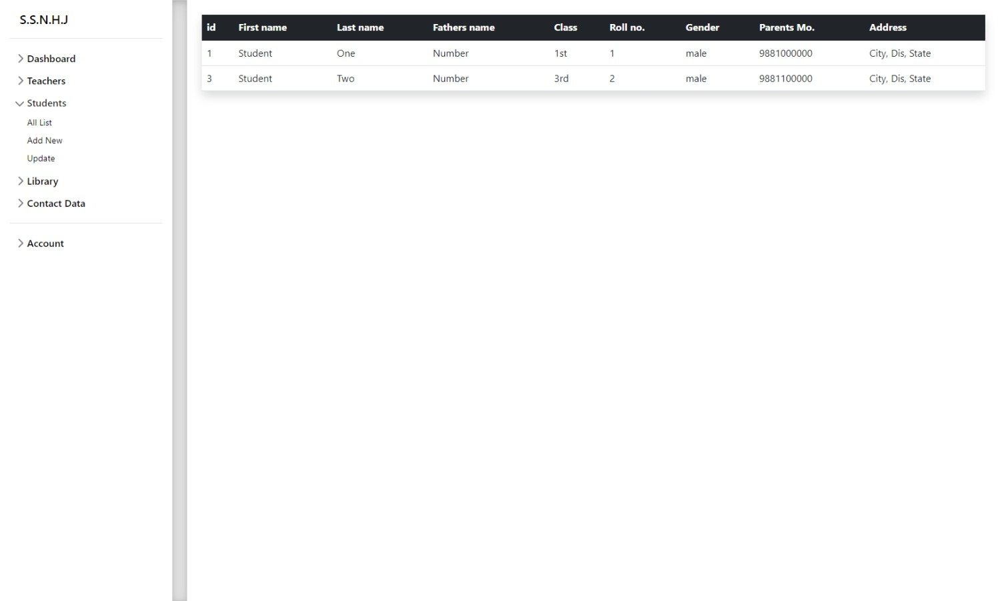

* Admin Add New Teacher Screen

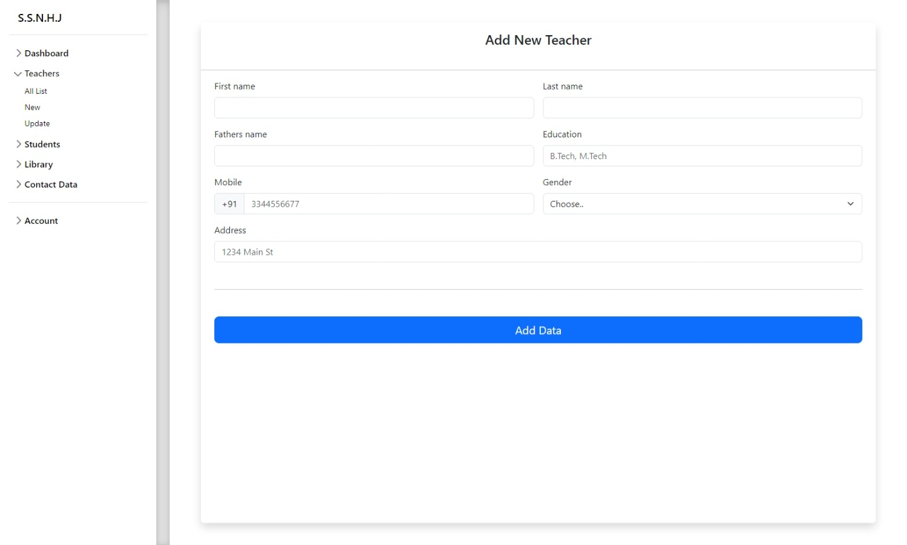

* Admin Form Data Screen

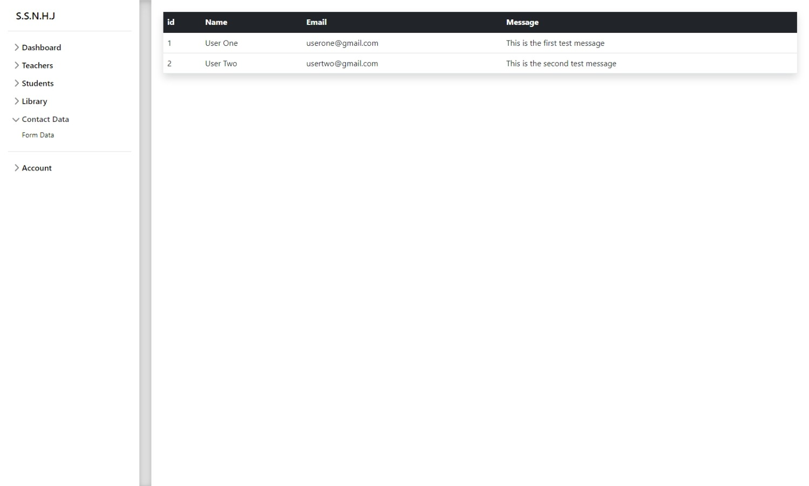


The School Management System is a PHP-based website designed to efficiently store and manage records of school students, teachers, and the library. It offers a user-friendly interface that simplifies the process of storing and accessing vital information. In addition to record-keeping, the website also provides a contact form that allows users to send messages easily.

The primary objective of the School Management System is to centralize student-related data, enabling administrators to maintain accurate records of student profiles. This includes personal details, academic information, attendance records, and contact information. Teachers can also access this data to track student progress and communicate effectively with parents.

Furthermore, the system offers a comprehensive platform for managing teacher information. It allows administrators to create and maintain teacher profiles, including qualifications, experience, and contact details. This facilitates effective communication and enables administrators to assign subjects and classes to teachers efficiently.

The School Management System also features a library management module. It enables librarians to organize and track books, manage borrowing and returning processes, and generate reports on library activities. Students and teachers can search for books, view availability, and place requests through the system.

In conclusion, the School Management System is a PHP-based website that serves as a centralized platform for storing and managing student, teacher, and library records. Its user-friendly interface, along with the contact form feature, enhances communication and facilitates efficient administration within the school environment.

## Built With

* HTML: Used for structuring the web pages.
* CSS: Used for styling the web pages.
* PHP: Used for server-side scripting and handling form submissions.
* MySQL: Used as the database management system to store user information, coffee products, and orders.
* Bootstrap 5: Used to design ui interface of the website

* []()

## Getting Started

This is an example of how you may give instructions on setting up your project locally. To get a local copy up and running follow these simple example steps.

### Prerequisites

This is an example of how to list things you need to use the software and how to install them.
* XAMP
* VS Code

### Installation

1. Clone the repo

 * Imp ( Clone the repo in C:\xampp\htdocs\ )

```sh
git clone https://github.com/omd01/School-Management-System.git
```

2. Set up the web server:

- Make sure you have a web server (such as Apache and MySQL) installed and running on your machine.
- Configure the web server to point to the root directory of the cloned repository.

4. Set up the database:

- Import the `school.sql` file into your MySQL server to create the necessary tables.
- Update the database connection details in the `connection.php` file to match your MySQL server configuration.


## Usage

- Open a web browser and navigate to the URL of your web server.

- Admins can log into the Admin Dashboard

- Admin can add students, teachers, books etc 

- Admin User Name : admin
- Admin Password  : admin


## Authors

* **Om Dahale** - *IT Student* - [Om Dahale](https://github.com/omd01/) - *Developed Full Project*

## Acknowledgements

* [Om Dahale](https://github.com/omd01/)
* [Online Coffee Shop](https://github.com/omd01/Online_Coffee_Shop)
* [Company (ODTECH)](https://github.com/odtech/)
